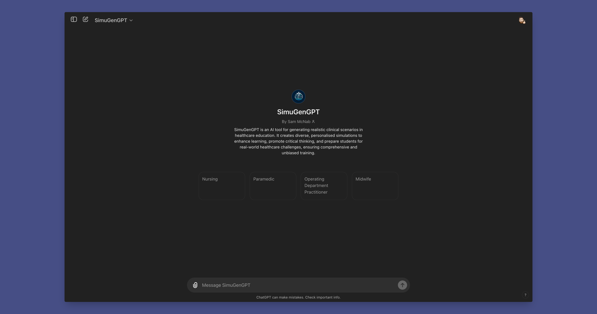

<!-- TOP ROW OF BADGES -->

[![Contributors][contributors-shield]][contributors-url]
[![Forks][forks-shield]][forks-url]
[![Stargazers][stars-shield]][stars-url]
[![Issues][issues-shield]][issues-url]
[![MIT License][license-shield]][license-url]
[![Kofi][kofi-badge]][kofi-url]

<!-- PROJECT LOGO -->
 

  

<h3 align="center">SimuGenGPT</h3>

  

    An AI tool for generating realistic clinical scenarios in healthcare education. 🚀📁
     
    <a href="https://smcnab1.github.io/SimuGenGPT/"><strong>Explore the docs »</strong></a>
     
     
    <a href="https://github.com/smcnab1/SimuGenGPT">View Demo</a>
    ·
    <a href="https://github.com/smcnab1/SimuGenGPT/issues">Report Bug</a>
    ·
    <a href="https://github.com/smcnab1/SimuGenGPT/issues">Request Feature</a>
  

  
View Contents

_Last Updated 19 Jun 24_
<!-- toc -->

- [About The Project](#about-the-project)
  - [Features](#features)
  - [Built with](#built-with)
- [Getting started](#getting-started)
  - [Prerequisites](#prerequisites)
  - [Install](#install)
  - [Usage](#usage)
- [Back Matter](#back-matter)
  - [Roadmap](#roadmap)
  - [Contributing](#contributing)
  - [License](#license)

<!-- tocstop -->
  

<!-- ABOUT THE PROJECT -->
## About The Project

  
  

  
SimuGenGPT is an AI tool for generating realistic clinical scenarios in healthcare education. It creates diverse, personalised simulations to enhance learning, promote critical thinking, and prepare students for real-world healthcare challenges, ensuring comprehensive and unbiased training.

(<a href="#readme-top">back to top</a>)

### Features

- Realistic patient scenarios with detailed patient information
- Diverse scenarios covering a wide range of medical conditions and backgrounds
- Integration with UK healthcare guidelines and protocols
- Capability to generate realistic images of wounds and injuries

### Built with

- OpenAI
- Python

(<a href="#readme-top">back to top</a>)

## Getting started

### Prerequisites

Accessible [via GPT Store on OpenAI](https://chatgpt.com/g/g-eTexeFjiJ-simugengpt).

### Install

1. Click on [use template](https://github.com/new?template_name=SimuGenGPT&template_owner=smcnab1) to generate new repository from template.

2. Enter repository name and Description.

3. Generate new repository.

4. Navigate to **Settings > Actions > General** and set ***Workflow Permissions*** to _Read and write permissions_

(<a href="#readme-top">back to top</a>)

## Back Matter

<!-- ROADMAP -->
### Roadmap

- [ ] Finalise Documentation.
- [ ] Expand scenario database
- [ ] Enhance scenario customization options
- [ ] Release version 2.0.0

See the [open issues](https://github.com/smcnab1/SimuGenGPT/issues) for a full list of proposed features (and known issues).

(<a href="#readme-top">back to top</a>)

<!-- CONTRIBUTING -->

### Contributing

Contributions are what make the open source community such an amazing place to learn, inspire, and create. Any contributions you make are **greatly appreciated**.

If you have a suggestion that would make this better, please fork the repo and create a pull request. You can also simply open an issue with the tag "enhancement" or "feature-request".
Don't forget to give the project a star! Thanks again!

1. Fork the Project.
2. Create your Feature Branch (`git checkout -b feature/AmazingFeature`)
3. Commit your Changes (`git commit -m 'Add some AmazingFeature'`)
4. Push to the Branch (`git push origin feature/AmazingFeature`)
5. Open a Pull Request

### License

This project is licensed under the [MIT License](LICENSE.md).

(<a href="#readme-top">back to top</a>)

<!-- MARKDOWN LINKS & IMAGES -->

[contributors-shield]: https://img.shields.io/github/contributors/smcnab1/SimuGenGPT.svg?style=for-the-badge
[contributors-url]: https://github.com/smcnab1/SimuGenGPT/graphs/contributors
[forks-shield]: https://img.shields.io/github/forks/smcnab1/SimuGenGPT.svg?style=for-the-badge
[forks-url]: https://github.com/smcnab1/SimuGenGPT/network/members
[stars-shield]: https://img.shields.io/github/stars/smcnab1/SimuGenGPT.svg?style=for-the-badge
[stars-url]: https://github.com/smcnab1/SimuGenGPT/stargazers
[issues-shield]: https://img.shields.io/github/issues/smcnab1/SimuGenGPT.svg?style=for-the-badge
[issues-url]: https://github.com/smcnab1/SimuGenGPT/issues
[license-shield]: https://img.shields.io/github/license/smcnab1/SimuGenGPT.svg?style=for-the-badge
[license-url]: https://github.com/smcnab1/SimuGenGPT/blob/master/LICENSE.md
[linkedin-shield]: https://img.shields.io/badge/-LinkedIn-black.svg?style=for-the-badge&logo=linkedin&colorB=555
[linkedin-url]: https://www.linkedin.com/in/sammcnab/
[product-screenshot]: images/screenshot.png
[email-badge]: https://img.shields.io/badge/Email-D14836?style=for-the-badge&logo=gmail&logoColor=white
[email-url]: mailto:sam@sammcnab.co.uk
[git-badge]: https://img.shields.io/badge/GitHub-100000?style=for-the-badge&logo=github&logoColor=white
[git-url]: https://github.com/smcnab1
[kofi-badge]: https://ko-fi.com/img/githubbutton_sm.svg
[kofi-url]: https://ko-fi.com/sammcnab1
