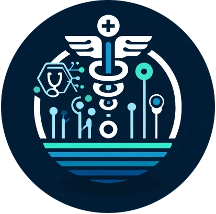

<div align="center">

<a href="https://smcnab1.github.io/SimuGen/">
  
</a>

# SimuGen

**Clinical simulation scenario design for healthcare education**

Create structured, realistic and educationally purposeful clinical simulation scenarios using ChatGPT.

[Website](https://smcnab1.github.io/SimuGen/) ·
[Report an issue](https://github.com/smcnab1/SimuGen/issues) ·
[Request a feature](https://github.com/smcnab1/SimuGen/issues)

[](LICENSE.md)
[](https://github.com/smcnab1/SimuGen/releases)
[](https://github.com/smcnab1/SimuGen/issues)

</div>

---

## About SimuGen

SimuGen is an open-source ChatGPT plugin for designing clinical simulation scenarios for healthcare education and training.

It helps educators turn a clinical idea, learning objective or broad topic into a structured simulation package that can include patient presentation, observations, investigations, scenario progression, expected learner actions, faculty guidance, equipment, moulage and debriefing prompts.

SimuGen is primarily designed around UK healthcare education and terminology, while supporting other settings when requested.

## Features

- Structured clinical simulation scenario generation
- Adaptation to profession, learner level and clinical setting
- Clinically plausible patient presentations and observations
- Scenario progression based on learner actions
- Learning objectives and expected learner actions
- Faculty guidance and simulated-patient information
- Equipment, environment and moulage requirements
- Debriefing questions and discussion themes
- UK-focused healthcare terminology and evidence sources
- Synthetic patient data designed specifically for simulation
- Support for paramedic, nursing, medical, mental health, paediatric, maternity and other healthcare scenarios

## Example prompts

SimuGen can work from anything from a broad idea to a detailed educational brief.

```text
Create a 20-minute paramedic simulation for final-year students
managing severe asthma in a home setting.
```

```text
Build a ward-based nursing deterioration scenario using NEWS2,
with staged observations, expected learner actions and debrief questions.
```

```text
Create a paediatric emergency simulation with learning objectives,
faculty guidance, equipment and scenario progression.
```

```text
I have these learning outcomes for a simulation session.
Build a scenario around them for second-year students.
```

## Scenario output

Depending on the request, SimuGen can produce:

- Scenario overview and learning objectives
- Patient profile and clinical background
- Initial presentation
- Vital signs and observations
- Relevant investigations
- Scenario phases and progression
- Expected learner actions
- Treatment and medication considerations
- Faculty and simulated-patient guidance
- Equipment and environmental requirements
- Moulage requirements
- Debriefing prompts
- Suggested educational resources

Outputs are adapted to the requested learner group, profession, setting and level of complexity.

## Clinical safety and synthetic data

SimuGen is designed for **healthcare education and simulation**, not for directing the diagnosis or treatment of a real patient.

Generated scenarios should use fictional training information only.

SimuGen is instructed not to request or generate genuine:

- NHS numbers
- Patient record numbers
- Home addresses
- Telephone numbers
- Government identifiers
- Other identifiable real-patient information

Users should not provide identifiable patient information or protected health information when creating scenarios.

Clinical content generated by AI can be incomplete or inaccurate. Educators remain responsible for reviewing scenarios before using them in teaching or assessment and should verify clinical information against current authoritative guidance and local organisational policies.

## UK clinical context

Where relevant, SimuGen is designed to work with UK healthcare terminology and recognised sources such as:

- [NICE](https://www.nice.org.uk/)
- [NHS](https://www.nhs.uk/)
- [Resuscitation Council UK](https://www.resus.org.uk/)
- [British National Formulary](https://bnf.nice.org.uk/)
- Relevant Royal Colleges and professional bodies
- Current national and local clinical guidance

SimuGen should not invent citations or claim alignment with guidance that has not been verified.

## Plugin structure

SimuGen is implemented as a skills-based OpenAI plugin.

```text
plugin/
├── plugin.json
├── assets/
│   └── logo.png
└── skills/
    └── generate-clinical-scenario/
        └── SKILL.md
```

The plugin currently requires no:

- Backend service
- Database
- User account
- Authentication
- MCP server
- External API

The clinical scenario generation behaviour is defined in:

```text
plugin/skills/generate-clinical-scenario/SKILL.md
```

## Website

The public SimuGen website is hosted using GitHub Pages:

**https://smcnab1.github.io/SimuGen/**

It provides project information together with the current privacy policy and terms of service.

The website is a statically exported Next.js application and does not operate its own backend or database.

## Development

### Requirements

- Node.js
- npm

### Install dependencies

```bash
npm ci
```

### Run locally

```bash
npm run dev
```

### Build

```bash
npm run build
```

The production build uses Next.js static export for deployment through GitHub Pages.

## Repository structure

```text
SimuGen/
├── app/                  # Public website
├── components/           # Website components
├── plugin/               # OpenAI plugin package
│   ├── assets/
│   ├── skills/
│   └── plugin.json
├── public/               # Website assets
├── PRIVACY.md
├── TERMS.md
├── CHANGELOG.md
├── LICENSE.md
└── README.md
```

## Roadmap

Development beyond the initial public plugin will focus on useful, distinct simulation workflows rather than expanding the generator unnecessarily.

Potential additions include:

- Clinical simulation scenario review
- Structured quality and educational-design feedback
- Scenario improvement recommendations
- Additional reusable simulation resources and templates

See the [GitHub issues](https://github.com/smcnab1/SimuGen/issues) for current work and feature requests.

## Contributing

Contributions, bug reports and suggestions are welcome.

For a code contribution:

1. Fork the repository.
2. Create a feature branch.
3. Make and test your changes.
4. Commit the changes.
5. Push your branch.
6. Open a pull request.

For bugs, clinical-content concerns or feature suggestions, open a [GitHub issue](https://github.com/smcnab1/SimuGen/issues).

Please do not include confidential, identifiable patient or sensitive personal information in issues, discussions or pull requests.

See [CONTRIBUTING.md](.github/CONTRIBUTING.md) for further guidance.

## Privacy

SimuGen does not operate its own conversation-processing backend or database.

See:

- [Privacy Policy](https://smcnab1.github.io/SimuGen/privacy/)
- [PRIVACY.md](PRIVACY.md)

## Terms

Use of SimuGen is subject to its terms of service.

See:

- [Terms of Service](https://smcnab1.github.io/SimuGen/terms/)
- [TERMS.md](TERMS.md)

## Support

For support, bug reports and feature requests:

[github.com/smcnab1/SimuGen/issues](https://github.com/smcnab1/SimuGen/issues)

## Licence

SimuGen is released under the [MIT Licence](LICENSE.md).

Copyright © 2026 Sam McNab.
